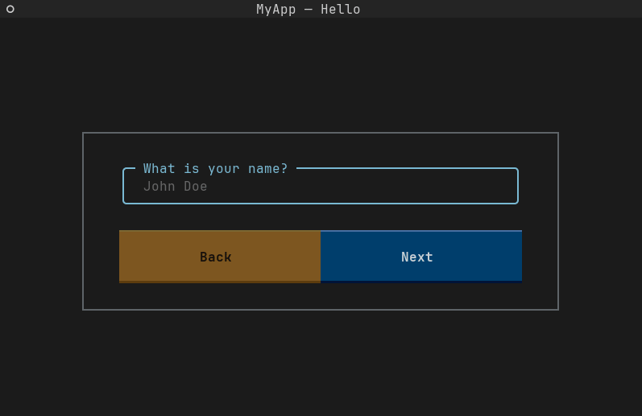

<p align="center">
  
</p>

<p align="center">
  
  
  
  
  

</p>

<p align="center">💠 We bring life to your terminal applications! 💠</p>

# Documentation

[**--> Please head over to our documentation for more information! <--**](https://textual-wizard.skwal.net)

# How to install 📥

You can install textual-wizard easily with pip to use it in your projects:

```bash
pip install textual-wizard
```

> [!CAUTION]
> Textual Wizard requires at least Python 3.12.
> You will not be able to install the library with pip if this requirement is not met.

# Demonstration



# Contributing 🤝

**For contribution instructions, take a look at the `contributing` section of [our documentation](https://textual-wizard.skwal.net/).**
