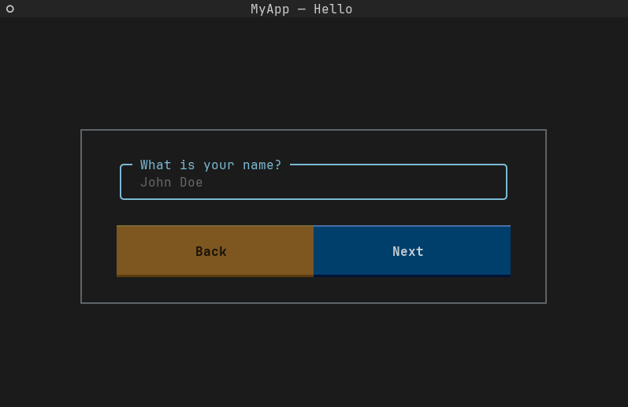

---
hide:
  - navigation
  - toc
---

# Welcome

💠 We bring life to your terminal applications 💠

---

👋 Welcome to the Textual Wizard documentation!

[Get Started](getting-started/index.md){ .md-button .md-button--primary }

## What is Textual Wizard?

Textual Wizard is a straightforward library that enables developers to create engaging wizards within text-only environments.
 
**After all, who said terminals had to be boring?**

-   :material-scale-balance:{ .lg .middle } __Open Source__

    ---

    Textual Wizard is licensed under GPLv3. It is open source, enabling everyone to contribute and to add new features, and making the library grow rapidly.

-   :material-clock-fast:{ .lg .middle } __Easy to use__

    ---

    TW is very easy to use. You can build a wizard for your application in minutes.

-   :material-powershell:{ .lg .middle } __Remote__

    ---

    TW runs in a terminal environment. Therefore, it can be used over SSH.

## Demonstration

